# Design Document: AI Chat Application Enhancements

## Overview

This design extends an existing Ollama-based AI chat application built with React 19, Node.js/Express, and MongoDB. The current system supports conversation persistence, dual-model routing (Llama3 for chat, CodeLlama for code), web search integration (DuckDuckGo/Wikipedia), voice I/O, image search, notes generation, and file upload.

The enhancements add 15 major features organized into four categories:

1. **Core Chat Enhancements**: Message reactions, response regeneration, stop generation, message branching, conversation search, and organization (folders/tags)
2. **Location & Context Services**: News integration, weather service, and GPS location support
3. **Advanced Features**: User authentication, conversation sharing, scheduled prompts, webhooks, and plugin system
4. **Semantic Search**: Local vector database for semantic conversation search

The design maintains backward compatibility with existing features while introducing new capabilities through modular architecture patterns.

## Architecture

### High-Level Architecture

```mermaid
graph TB
    subgraph "Client Layer"
        UI[React UI]
        VoiceIO[Voice I/O]
        FileUpload[File Upload]
    end
    
    subgraph "API Gateway"
        Express[Express Server]
        Auth[Auth Middleware]
        RateLimit[Rate Limiter]
    end
    
    subgraph "Core Services"
        ChatService[Chat Service]
        SearchService[Search Service]
        OllamaService[Ollama Service]
        NotesService[Notes Service]
    end
    
    subgraph "New Services"
        ReactionService[Reaction Service]
        BranchService[Branch Service]
        VectorService[Vector DB Service]
        LocationService[Location Service]
        WeatherService[Weather Service]
        NewsService[News Service]
        SchedulerService[Scheduler Service]
        WebhookService[Webhook Service]
        PluginService[Plugin Service]
        ShareService[Share Service]
    end
    
    subgraph "Data Layer"
        MongoDB[(MongoDB)]
        VectorDB[(Vector DB)]
        Cache[(Redis Cache)]
    end
    
    subgraph "External Services"
        Ollama[Ollama LLM]
        WeatherAPI[Weather API]
        NewsAPI[News API]
        GPSAPI[GPS/Geolocation]
    end
    
    UI --> Express
    VoiceIO --> Express
    FileUpload --> Express
    
    Express --> Auth
    Express --> RateLimit
    Express --> ChatService
    Express --> SearchService
    Express --> NotesService
    
    ChatService --> ReactionService
    ChatService --> BranchService
    ChatService --> VectorService
    ChatService --> OllamaService
    
    LocationService --> GPSAPI
    WeatherService --> WeatherAPI
    NewsService --> NewsAPI
    
    ChatService --> MongoDB
    ReactionService --> MongoDB
    BranchService --> MongoDB
    VectorService --> VectorDB
    WeatherService --> Cache
    
    SchedulerService --> WebhookService
    PluginService --> ChatService
    ShareService --> MongoDB
    
    OllamaService --> Ollama
```



### Technology Stack

**Frontend:**
- React 19 with hooks
- Vite for build tooling
- Axios for HTTP requests
- React Markdown for message rendering
- Web Speech API for voice I/O

**Backend:**
- Node.js with Express
- MongoDB with Mongoose ODM
- Redis for caching (new)
- JWT for authentication (new)
- Node-cron for scheduling (new)

**AI & Search:**
- Ollama (Llama3 & CodeLlama)
- Vectorize.js or similar for local embeddings (new)
- DuckDuckGo/Wikipedia search (existing)

**External APIs:**
- OpenWeatherMap or WeatherAPI.com
- NewsAPI.org or similar
- Browser Geolocation API

### Design Principles

1. **Backward Compatibility**: All existing features continue to work without modification
2. **Modular Services**: Each enhancement is implemented as a separate service module
3. **Progressive Enhancement**: Features degrade gracefully when dependencies are unavailable
4. **User Privacy**: Location and personal data require explicit user consent
5. **Extensibility**: Plugin system allows third-party extensions without core modifications

## Components and Interfaces

### 1. Message Reactions System

**Components:**
- `ReactionButton` (React component)
- `ReactionService` (backend service)
- `ReactionController` (API endpoints)

**Data Flow:**
```
User clicks reaction → API call → ReactionService validates → 
Update MongoDB → Return updated reaction state → UI updates
```

**API Endpoints:**
```typescript
POST   /api/reactions
  Body: { messageId: string, conversationId: string, type: 'like' | 'dislike' }
  Response: { success: boolean, reaction: Reaction }

PUT    /api/reactions/:id
  Body: { type: 'like' | 'dislike' }
  Response: { success: boolean, reaction: Reaction }

GET    /api/reactions/conversation/:conversationId
  Response: { reactions: Reaction[] }
```

**React Component Interface:**
```typescript
interface ReactionButtonProps {
  messageId: string;
  conversationId: string;
  currentReaction?: 'like' | 'dislike' | null;
  onReactionChange: (reaction: 'like' | 'dislike') => void;
}
```

### 2. Response Regeneration

**Components:**
- `RegenerateButton` (React component)
- Enhanced `ChatController.sendMessage` (backend)

**Data Flow:**
```
User clicks regenerate → Extract original prompt → 
Call Ollama with same context → Store new response → 
Archive old response → Update UI with new response
```

**API Endpoints:**
```typescript
POST   /api/chat/regenerate
  Body: { messageId: string, conversationId: string }
  Response: { 
    conversationId: string,
    newMessage: Message,
    archivedMessage: Message
  }
```

**Implementation Strategy:**
- Store message history with version numbers
- Keep original prompt reference in each AI message
- Regeneration creates new message with incremented version
- UI shows latest version by default, allows viewing history

### 3. Stop Generation

**Components:**
- `StopButton` (React component)
- `StreamController` (backend service for managing streams)

**Data Flow:**
```
User clicks stop → Send abort signal → 
Ollama stream terminates → Save partial response → 
Mark message as incomplete → Update UI
```

**API Endpoints:**
```typescript
POST   /api/chat/stop
  Body: { streamId: string }
  Response: { success: boolean, partialMessage: Message }
```

**Implementation Strategy:**
- Use AbortController for fetch requests to Ollama
- Assign unique streamId to each generation request
- Store streamId in client state during generation
- Backend maintains active stream registry
- Partial responses marked with `incomplete: true` flag

### 4. Message Branching

**Components:**
- `BranchButton` (React component)
- `BranchService` (backend service)
- `BranchNavigator` (React component for branch visualization)

**Data Flow:**
```
User clicks branch at message N → Create new branch → 
Copy messages 0 to N → Create branch reference → 
Allow new messages in branch → Update UI with branch indicator
```

**API Endpoints:**
```typescript
POST   /api/branches
  Body: { conversationId: string, branchFromMessageIndex: number }
  Response: { branch: Branch, newConversationId: string }

GET    /api/branches/conversation/:conversationId
  Response: { branches: Branch[], currentBranch: string }

POST   /api/branches/switch
  Body: { conversationId: string, branchId: string }
  Response: { messages: Message[] }
```

**Branch Visualization:**
```
Main conversation
├─ Message 1
├─ Message 2
│  ├─ Branch A (from Message 2)
│  │  └─ Message 3a
│  └─ Branch B (from Message 2)
│     └─ Message 3b
└─ Message 3 (main)
```

### 5. Conversation Search

**Components:**
- `SearchBar` (React component)
- `SearchService` (backend service)
- `SearchResults` (React component)

**Data Flow:**
```
User enters query → API call → SearchService queries MongoDB → 
Full-text search on message content → Return matches with context → 
Display results with highlighting → Navigate on click
```

**API Endpoints:**
```typescript
GET    /api/search
  Query: { q: string, userId: string, limit?: number }
  Response: { 
    results: SearchResult[],
    totalCount: number,
    executionTime: number
  }

interface SearchResult {
  conversationId: string;
  conversationTitle: string;
  messageId: string;
  messageContent: string;
  messageRole: 'user' | 'ai';
  contextBefore: string;
  contextAfter: string;
  timestamp: Date;
  relevanceScore: number;
}
```

**Implementation Strategy:**
- MongoDB text index on `messages.content` field
- Return 3 messages of context (1 before, 1 after)
- Highlight matching terms in results
- Cache recent searches in Redis (5 minute TTL)

### 6. Conversation Organization (Folders & Tags)

**Components:**
- `FolderTree` (React component)
- `TagManager` (React component)
- `OrganizationService` (backend service)

**Data Flow:**
```
User creates folder → Store in MongoDB → 
User drags conversation to folder → Update conversation.folderId → 
User applies tags → Update conversation.tags array → 
Filter sidebar by folder/tag → Display organized conversations
```

**API Endpoints:**
```typescript
// Folders
POST   /api/folders
  Body: { name: string, parentId?: string }
  Response: { folder: Folder }

GET    /api/folders
  Response: { folders: Folder[] }

PUT    /api/folders/:id
  Body: { name: string }
  Response: { folder: Folder }

DELETE /api/folders/:id
  Response: { success: boolean }

// Tags
POST   /api/tags
  Body: { name: string, color?: string }
  Response: { tag: Tag }

GET    /api/tags
  Response: { tags: Tag[] }

// Conversation organization
PUT    /api/chat/:id/folder
  Body: { folderId: string | null }
  Response: { success: boolean }

PUT    /api/chat/:id/tags
  Body: { tagIds: string[] }
  Response: { success: boolean }
```

### 7. News Integration

**Components:**
- `NewsService` (backend service)
- Enhanced `ChatController` with news context

**Data Flow:**
```
User asks news-related question → Extract topics/location → 
Query NewsAPI → Format results → Include in LLM context → 
Generate response with news data → Display with source links
```

**API Endpoints:**
```typescript
GET    /api/news
  Query: { 
    topics?: string[], 
    location?: string, 
    limit?: number 
  }
  Response: { 
    articles: NewsArticle[],
    source: string,
    timestamp: Date
  }

interface NewsArticle {
  title: string;
  source: string;
  url: string;
  publishedAt: Date;
  summary: string;
  imageUrl?: string;
}
```

**Implementation Strategy:**
- Integrate with NewsAPI.org (free tier: 100 requests/day)
- Cache news results for 15 minutes per topic/location
- Extract topics using keyword detection or LLM
- Include news context in system prompt when relevant

### 8. Weather Service

**Components:**
- `WeatherService` (backend service)
- `WeatherWidget` (React component - optional display)

**Data Flow:**
```
User requests weather → Get location (GPS or query) → 
Query WeatherAPI → Cache result → Format data → 
Include in LLM context → Generate weather-aware response
```

**API Endpoints:**
```typescript
GET    /api/weather
  Query: { location?: string, lat?: number, lon?: number }
  Response: { 
    location: string,
    current: CurrentWeather,
    forecast: ForecastDay[],
    timestamp: Date
  }

interface CurrentWeather {
  temperature: number;
  feelsLike: number;
  condition: string;
  humidity: number;
  windSpeed: number;
  icon: string;
}

interface ForecastDay {
  date: Date;
  high: number;
  low: number;
  condition: string;
  icon: string;
}
```

**Implementation Strategy:**
- Use OpenWeatherMap API (free tier: 1000 calls/day)
- Cache weather data for 30 minutes per location
- Store user's last known location in session
- Fallback to IP-based geolocation if GPS unavailable

### 9. GPS Location Support

**Components:**
- `LocationService` (frontend service using Geolocation API)
- `LocationController` (backend for storing preferences)

**Data Flow:**
```
App loads → Request permission → User grants → 
Get coordinates → Store in session → Update every 5 minutes → 
Use for weather/news requests
```

**API Endpoints:**
```typescript
POST   /api/location/preferences
  Body: { 
    enabled: boolean, 
    manualLocation?: string 
  }
  Response: { success: boolean }

GET    /api/location/preferences
  Response: { 
    enabled: boolean, 
    manualLocation?: string 
  }
```

**Frontend Implementation:**
```typescript
interface LocationService {
  requestPermission(): Promise<boolean>;
  getCurrentLocation(): Promise<Coordinates>;
  watchLocation(callback: (coords: Coordinates) => void): number;
  clearWatch(watchId: number): void;
}

interface Coordinates {
  latitude: number;
  longitude: number;
  accuracy: number;
  timestamp: Date;
}
```

### 10. User Authentication

**Components:**
- `AuthService` (backend service)
- `LoginForm` (React component)
- `RegisterForm` (React component)
- `AuthContext` (React context for auth state)
- `authMiddleware` (Express middleware)

**Data Flow:**
```
User registers → Hash password → Store in MongoDB → 
User logs in → Verify credentials → Generate JWT → 
Store token in localStorage → Include in API requests → 
Middleware validates token → Attach userId to request
```

**API Endpoints:**
```typescript
POST   /api/auth/register
  Body: { 
    email: string, 
    password: string, 
    name: string 
  }
  Response: { 
    user: User, 
    token: string 
  }

POST   /api/auth/login
  Body: { email: string, password: string }
  Response: { user: User, token: string }

POST   /api/auth/logout
  Headers: { Authorization: 'Bearer <token>' }
  Response: { success: boolean }

POST   /api/auth/reset-password
  Body: { email: string }
  Response: { success: boolean, message: string }

POST   /api/auth/reset-password/confirm
  Body: { token: string, newPassword: string }
  Response: { success: boolean }

GET    /api/auth/me
  Headers: { Authorization: 'Bearer <token>' }
  Response: { user: User }
```

**Security Implementation:**
- Passwords hashed with bcrypt (10 rounds minimum)
- JWT tokens with 7-day expiration
- Refresh token mechanism for extended sessions
- Password requirements: 8+ characters, 1 uppercase, 1 number
- Rate limiting: 5 login attempts per 15 minutes per IP

### 11. Conversation Sharing

**Components:**
- `ShareButton` (React component)
- `ShareModal` (React component for permissions)
- `ShareService` (backend service)
- `SharedConversationView` (React component)

**Data Flow:**
```
User clicks share → Select permissions → Generate share link → 
Copy to clipboard → Recipient opens link → Validate permissions → 
Display conversation (read-only or editable) → Track access
```

**API Endpoints:**
```typescript
POST   /api/share
  Body: { 
    conversationId: string, 
    permission: 'view' | 'comment' | 'edit',
    expiresAt?: Date
  }
  Response: { 
    shareLink: string, 
    shareId: string 
  }

GET    /api/share/:shareId
  Response: { 
    conversation: Conversation, 
    permission: string,
    owner: User
  }

DELETE /api/share/:shareId
  Response: { success: boolean }

GET    /api/share/conversation/:conversationId
  Response: { shares: Share[] }

POST   /api/share/:shareId/message
  Body: { content: string }
  Response: { message: Message }
```

**Permission Levels:**
- **View**: Read-only access to conversation
- **Comment**: Can add messages marked as comments (not sent to LLM)
- **Edit**: Full access to add messages and regenerate responses

### 12. Scheduled Prompts

**Components:**
- `SchedulerService` (backend service using node-cron)
- `ScheduleManager` (React component)
- `ScheduledPromptForm` (React component)

**Data Flow:**
```
User creates schedule → Store in MongoDB → 
Cron job checks schedules → Time matches → 
Execute prompt → Generate response → 
Store in conversation → Notify user (optional)
```

**API Endpoints:**
```typescript
POST   /api/schedules
  Body: { 
    prompt: string, 
    schedule: string, // cron format
    conversationId?: string,
    enabled: boolean
  }
  Response: { schedule: ScheduledPrompt }

GET    /api/schedules
  Response: { schedules: ScheduledPrompt[] }

PUT    /api/schedules/:id
  Body: { 
    prompt?: string, 
    schedule?: string, 
    enabled?: boolean 
  }
  Response: { schedule: ScheduledPrompt }

DELETE /api/schedules/:id
  Response: { success: boolean }

GET    /api/schedules/:id/history
  Response: { executions: ScheduleExecution[] }
```

**Schedule Format Examples:**
- Daily at 9 AM: `0 9 * * *`
- Every Monday at 8 AM: `0 8 * * 1`
- Every 6 hours: `0 */6 * * *`

**Implementation Strategy:**
- Use node-cron for scheduling
- Store last execution time to prevent duplicates
- Retry failed executions once after 5 minutes
- Log all executions with status and error messages
- Support timezone configuration per user

### 13. Webhooks

**Components:**
- `WebhookService` (backend service)
- `WebhookManager` (React component)
- `WebhookTester` (React component for testing)

**Data Flow:**
```
User configures webhook → Store in MongoDB → 
Trigger condition met → Build payload → 
Send HTTP POST → Retry on failure → 
Log execution → Display status in UI
```

**API Endpoints:**
```typescript
POST   /api/webhooks
  Body: { 
    url: string, 
    triggers: WebhookTrigger[],
    headers?: Record<string, string>,
    enabled: boolean
  }
  Response: { webhook: Webhook }

GET    /api/webhooks
  Response: { webhooks: Webhook[] }

PUT    /api/webhooks/:id
  Body: { 
    url?: string, 
    triggers?: WebhookTrigger[], 
    enabled?: boolean 
  }
  Response: { webhook: Webhook }

DELETE /api/webhooks/:id
  Response: { success: boolean }

POST   /api/webhooks/:id/test
  Response: { 
    success: boolean, 
    statusCode: number, 
    responseTime: number 
  }

GET    /api/webhooks/:id/logs
  Response: { logs: WebhookLog[] }

interface WebhookTrigger {
  type: 'keyword' | 'tag' | 'conversation';
  value: string;
}

interface WebhookPayload {
  event: string;
  timestamp: Date;
  userId: string;
  conversationId: string;
  messageId: string;
  messageContent: string;
  trigger: WebhookTrigger;
}
```

**Implementation Strategy:**
- Retry logic: 3 attempts with exponential backoff (1s, 2s, 4s)
- Timeout: 10 seconds per request
- Log all executions with response codes
- Support custom headers for authentication
- Validate webhook URLs before saving

### 14. Plugin System

**Components:**
- `PluginService` (backend service)
- `PluginManager` (React component)
- `PluginAPI` (interface for plugin developers)

**Data Flow:**
```
Developer creates plugin → Implements PluginAPI → 
User installs plugin → PluginService validates → 
Plugin registers hooks → System calls hooks → 
Plugin executes → Returns result → System continues
```

**Plugin API Interface:**
```typescript
interface Plugin {
  name: string;
  version: string;
  description: string;
  author: string;
  
  // Lifecycle hooks
  onLoad(): Promise<void>;
  onUnload(): Promise<void>;
  
  // Message processing hooks
  onBeforeMessage?(context: MessageContext): Promise<MessageContext>;
  onAfterMessage?(context: MessageContext, response: string): Promise<string>;
  
  // Custom commands
  commands?: PluginCommand[];
  
  // UI components
  uiComponents?: PluginUIComponent[];
}

interface MessageContext {
  userId: string;
  conversationId: string;
  message: string;
  history: Message[];
  metadata: Record<string, any>;
}

interface PluginCommand {
  name: string;
  description: string;
  execute(args: string[], context: MessageContext): Promise<string>;
}

interface PluginUIComponent {
  id: string;
  location: 'sidebar' | 'toolbar' | 'message';
  render(): React.ReactNode;
}
```

**API Endpoints:**
```typescript
POST   /api/plugins/install
  Body: { pluginUrl: string }
  Response: { plugin: Plugin, success: boolean }

GET    /api/plugins
  Response: { plugins: Plugin[] }

POST   /api/plugins/:id/enable
  Response: { success: boolean }

POST   /api/plugins/:id/disable
  Response: { success: boolean }

DELETE /api/plugins/:id
  Response: { success: boolean }

POST   /api/plugins/:id/configure
  Body: { config: Record<string, any> }
  Response: { success: boolean }
```

**Implementation Strategy:**
- Plugins run in isolated context (VM2 or similar)
- Sandboxed access to system resources
- Plugin errors don't crash main application
- Plugins can access: message context, user data, LLM service
- Plugins cannot access: file system, network (except via provided APIs)
- Plugin registry for discovering community plugins

### 15. Local Vector Database

**Components:**
- `VectorService` (backend service)
- `EmbeddingService` (generates embeddings)
- `SemanticSearch` (React component)

**Data Flow:**
```
Message created → Generate embedding → Store in vector DB → 
User performs semantic search → Generate query embedding → 
Query vector DB → Rank by similarity → Return top results → 
Display with relevance scores
```

**API Endpoints:**
```typescript
POST   /api/vector/index
  Body: { messageId: string, content: string }
  Response: { success: boolean }

POST   /api/vector/search
  Body: { 
    query: string, 
    userId: string, 
    limit?: number,
    threshold?: number 
  }
  Response: { 
    results: SemanticSearchResult[],
    executionTime: number
  }

interface SemanticSearchResult {
  conversationId: string;
  conversationTitle: string;
  messageId: string;
  messageContent: string;
  messageRole: 'user' | 'ai';
  similarityScore: number;
  timestamp: Date;
}

POST   /api/vector/reindex
  Response: { 
    success: boolean, 
    indexed: number, 
    failed: number 
  }
```

**Implementation Strategy:**
- Use Vectorize.js or Transformers.js for local embeddings
- Model: all-MiniLM-L6-v2 (384 dimensions, fast, good quality)
- Storage: Custom vector index or LanceDB (local-first)
- Indexing: Async background job for new messages
- Search: Cosine similarity with threshold 0.7
- Hybrid search: Combine keyword + semantic results

**Vector Database Schema:**
```typescript
interface VectorEntry {
  id: string;
  userId: string;
  conversationId: string;
  messageId: string;
  content: string;
  embedding: number[]; // 384-dimensional vector
  timestamp: Date;
  metadata: {
    role: 'user' | 'ai';
    conversationTitle: string;
  };
}
```

## Data Models

### Enhanced Chat Model

```typescript
interface Chat {
  _id: string;
  userId: string; // NEW: owner of conversation
  title: string;
  messages: Message[];
  branches: Branch[]; // NEW: conversation branches
  folderId?: string; // NEW: organization
  tags: string[]; // NEW: organization
  sharedWith: Share[]; // NEW: sharing
  createdAt: Date;
  updatedAt: Date;
}

interface Message {
  _id: string;
  role: 'user' | 'ai';
  content: string;
  originalPrompt?: string; // NEW: for regeneration
  version: number; // NEW: for regeneration history
  incomplete: boolean; // NEW: for stopped generation
  reactions: Reaction[]; // NEW: user feedback
  branchId?: string; // NEW: which branch this belongs to
  createdAt: Date;
}

interface Reaction {
  _id: string;
  userId: string;
  messageId: string;
  conversationId: string;
  type: 'like' | 'dislike';
  createdAt: Date;
  updatedAt: Date;
}

interface Branch {
  _id: string;
  name: string;
  parentBranchId?: string;
  branchFromMessageIndex: number;
  createdAt: Date;
}
```

### User Model

```typescript
interface User {
  _id: string;
  email: string;
  passwordHash: string;
  name: string;
  preferences: UserPreferences;
  createdAt: Date;
  updatedAt: Date;
}

interface UserPreferences {
  locationEnabled: boolean;
  manualLocation?: string;
  timezone: string;
  theme: 'light' | 'dark';
  voiceEnabled: boolean;
  ttsEnabled: boolean;
}
```

### Organization Models

```typescript
interface Folder {
  _id: string;
  userId: string;
  name: string;
  parentId?: string;
  createdAt: Date;
  updatedAt: Date;
}

interface Tag {
  _id: string;
  userId: string;
  name: string;
  color: string;
  createdAt: Date;
  updatedAt: Date;
}
```

### Share Model

```typescript
interface Share {
  _id: string;
  conversationId: string;
  ownerId: string;
  shareId: string; // unique URL identifier
  permission: 'view' | 'comment' | 'edit';
  expiresAt?: Date;
  accessCount: number;
  lastAccessedAt?: Date;
  createdAt: Date;
}
```

### Scheduled Prompt Model

```typescript
interface ScheduledPrompt {
  _id: string;
  userId: string;
  prompt: string;
  schedule: string; // cron format
  conversationId?: string;
  enabled: boolean;
  lastExecutedAt?: Date;
  nextExecutionAt: Date;
  createdAt: Date;
  updatedAt: Date;
}

interface ScheduleExecution {
  _id: string;
  scheduleId: string;
  executedAt: Date;
  success: boolean;
  error?: string;
  messageId?: string;
}
```

### Webhook Model

```typescript
interface Webhook {
  _id: string;
  userId: string;
  url: string;
  triggers: WebhookTrigger[];
  headers: Record<string, string>;
  enabled: boolean;
  createdAt: Date;
  updatedAt: Date;
}

interface WebhookLog {
  _id: string;
  webhookId: string;
  executedAt: Date;
  success: boolean;
  statusCode?: number;
  responseTime: number;
  error?: string;
  payload: WebhookPayload;
}
```

### Plugin Model

```typescript
interface PluginMetadata {
  _id: string;
  userId: string;
  name: string;
  version: string;
  description: string;
  author: string;
  enabled: boolean;
  config: Record<string, any>;
  installedAt: Date;
  updatedAt: Date;
}
```

## Database Indexes

### MongoDB Indexes

```javascript
// Chat collection
db.chats.createIndex({ userId: 1, updatedAt: -1 });
db.chats.createIndex({ userId: 1, folderId: 1 });
db.chats.createIndex({ userId: 1, tags: 1 });
db.chats.createIndex({ "messages.content": "text" }); // Full-text search

// User collection
db.users.createIndex({ email: 1 }, { unique: true });

// Reaction collection
db.reactions.createIndex({ conversationId: 1, messageId: 1 });
db.reactions.createIndex({ userId: 1, messageId: 1 }, { unique: true });

// Share collection
db.shares.createIndex({ shareId: 1 }, { unique: true });
db.shares.createIndex({ conversationId: 1 });
db.shares.createIndex({ expiresAt: 1 }, { expireAfterSeconds: 0 });

// Scheduled prompts
db.scheduledPrompts.createIndex({ userId: 1, enabled: 1 });
db.scheduledPrompts.createIndex({ nextExecutionAt: 1, enabled: 1 });

// Webhooks
db.webhooks.createIndex({ userId: 1, enabled: 1 });

// Webhook logs
db.webhookLogs.createIndex({ webhookId: 1, executedAt: -1 });
db.webhookLogs.createIndex({ executedAt: 1 }, { expireAfterSeconds: 2592000 }); // 30 days
```


## Correctness Properties

A property is a characteristic or behavior that should hold true across all valid executions of a system—essentially, a formal statement about what the system should do. Properties serve as the bridge between human-readable specifications and machine-verifiable correctness guarantees.

### Message Reactions Properties

Property 1: Reaction persistence
*For any* message and user, when a reaction is recorded, querying the database should immediately return that reaction with the correct message ID, user ID, type, and timestamp
**Validates: Requirements 1.2, 1.4**

Property 2: Reaction updates
*For any* message with an existing reaction, when the user changes the reaction type, the database should contain exactly one reaction record for that user-message pair with the updated type
**Validates: Requirements 1.3**

Property 3: Reaction UI consistency
*For any* message with a stored reaction, the displayed UI should reflect the current reaction state (like or dislike)
**Validates: Requirements 1.5**

### Response Regeneration Properties

Property 4: Regeneration uses original prompt
*For any* AI message, when regenerated, the system should send the exact same prompt that was used to generate the original message
**Validates: Requirements 2.2**

Property 5: Regeneration preserves history
*For any* regenerated message, the message history should contain both the original and new versions with incremented version numbers
**Validates: Requirements 2.4**

Property 6: Unlimited regeneration
*For any* message, regenerating it multiple times (N times where N > 10) should always succeed without errors
**Validates: Requirements 2.5**

### Stop Generation Properties

Property 7: Stop terminates generation
*For any* ongoing LLM generation, when the stop signal is sent, the generation should terminate within 2 seconds
**Validates: Requirements 3.2**

Property 8: Stopped messages preserve partial content
*For any* stopped generation, the saved message should contain all content generated up to the stop point and be marked with incomplete=true
**Validates: Requirements 3.3, 3.4**

Property 9: Stopped messages allow regeneration
*For any* message marked as incomplete, the regenerate functionality should be available and functional
**Validates: Requirements 3.5**

### Message Branching Properties

Property 10: Branch creation preserves history
*For any* conversation and message index N, creating a branch should result in a new conversation containing messages 0 through N from the original
**Validates: Requirements 4.2, 4.3**

Property 11: Branch independence
*For any* branch, adding new messages to the branch should not affect the original conversation or other branches
**Validates: Requirements 4.4**

Property 12: Branch navigation
*For any* conversation with multiple branches, switching between branches should load the correct message history for each branch
**Validates: Requirements 4.5**

### Conversation Search Properties

Property 13: Search scope completeness
*For any* user and search query, the search results should include matches from all conversations owned by or shared with that user
**Validates: Requirements 5.1**

Property 14: Search results include context
*For any* search result, the returned data should include the matching message plus at least one message before and after for context
**Validates: Requirements 5.2**

Property 15: Full-text search coverage
*For any* text string present in a message, searching for that exact string should return that message in the results
**Validates: Requirements 5.4**

Property 16: Search navigation accuracy
*For any* search result, clicking it should navigate to the correct conversation and scroll to the exact message that matched
**Validates: Requirements 5.3**

### Organization Properties

Property 17: Folder creation uniqueness
*For any* folder name and user, creating a folder should result in a stored folder with a unique ID that doesn't conflict with existing folders
**Validates: Requirements 6.1**

Property 18: Conversation-folder association
*For any* conversation and folder, moving the conversation to the folder should update the conversation's folderId field to match the folder's ID
**Validates: Requirements 6.2**

Property 19: Tag association
*For any* conversation and tag, applying the tag should add the tag ID to the conversation's tags array without duplicates
**Validates: Requirements 6.3**

Property 20: Multiple tags support
*For any* conversation, applying N different tags (where N ≥ 3) should result in all N tags being stored in the tags array
**Validates: Requirements 6.4**

Property 21: Folder and tag filtering
*For any* folder or tag filter, the displayed conversations should include only those conversations that have the specified folder ID or tag ID
**Validates: Requirements 6.5**

Property 22: Folder and tag CRUD operations
*For any* folder or tag, renaming should update the name field, and deleting should remove it from the database and clear associations
**Validates: Requirements 6.6**

### News Integration Properties

Property 23: News service integration
*For any* news request with topics or location, the system should call the News API with those parameters and return formatted results
**Validates: Requirements 7.1, 7.4**

Property 24: Location-based news
*For any* news request without explicit location, when GPS is enabled, the system should use the GPS coordinates for the news query
**Validates: Requirements 7.2**

Property 25: Topic extraction
*For any* user query containing identifiable topics (e.g., "technology", "sports"), the system should extract those topics and include them in the news API call
**Validates: Requirements 7.3**

Property 26: News result completeness
*For any* news article returned, the result should include title, source, publication date, and summary fields
**Validates: Requirements 7.5**

Property 27: News service error handling
*For any* news request, when the News API is unavailable or returns an error, the system should continue processing the user's message without news data and inform the user
**Validates: Requirements 7.6**

### Weather Service Properties

Property 28: Weather service integration
*For any* weather request, the system should call the Weather API and return data including current conditions, temperature, and forecast
**Validates: Requirements 8.1, 8.4**

Property 29: Weather location defaults
*For any* weather request without explicit location, when GPS is enabled, the system should use GPS coordinates; otherwise, it should prompt for location
**Validates: Requirements 8.2**

Property 30: Weather location override
*For any* weather request with an explicit location in the query, the system should use that location instead of GPS coordinates
**Validates: Requirements 8.3**

Property 31: Weather caching
*For any* location, requesting weather data twice within 30 minutes should return cached data on the second request without calling the Weather API
**Validates: Requirements 8.5**

Property 32: Weather service error handling
*For any* weather request, when the Weather API is unavailable or returns an error, the system should continue processing the user's message without weather data and inform the user
**Validates: Requirements 8.6**

### GPS Location Properties

Property 33: GPS permission handling
*For any* user, when GPS permission is granted, the system should successfully retrieve and store location coordinates
**Validates: Requirements 9.2**

Property 34: GPS permission denial
*For any* user, when GPS permission is denied, the system should continue functioning with all non-location features working normally
**Validates: Requirements 9.3**

Property 35: Location preference override
*For any* user, setting a manual location should override GPS location for all location-based features
**Validates: Requirements 9.5**

Property 36: Location preference persistence
*For any* user, setting location preferences (enabled/disabled, manual location) should persist across sessions
**Validates: Requirements 9.6**

### User Authentication Properties

Property 37: Registration creates account
*For any* valid registration data (email, password, name), the system should create a user account with a hashed password (not plaintext)
**Validates: Requirements 10.1**

Property 38: Login creates session
*For any* valid credentials, logging in should return a JWT token that can be used to authenticate subsequent requests
**Validates: Requirements 10.2**

Property 39: Logout terminates session
*For any* active session, logging out should invalidate the JWT token so it cannot be used for future requests
**Validates: Requirements 10.3**

Property 40: Data ownership
*For any* user-created data (conversations, reactions, folders, tags), the data should be associated with the correct user ID and not accessible to other users
**Validates: Requirements 10.4, 10.5**

Property 41: Password reset functionality
*For any* registered user, requesting a password reset should generate a reset token that allows setting a new password
**Validates: Requirements 10.6**

Property 42: Password complexity validation
*For any* password, the system should reject passwords that don't meet complexity requirements (8+ characters, 1 uppercase, 1 number)
**Validates: Requirements 10.7**

### Conversation Sharing Properties

Property 43: Share link generation
*For any* conversation, creating a share should generate a unique share ID and URL that doesn't conflict with existing shares
**Validates: Requirements 11.1**

Property 44: Permission-based access
*For any* share link, accessing it should enforce the specified permission level: view-only prevents edits, comment allows comments, edit allows full access
**Validates: Requirements 11.2, 11.3, 11.4**

Property 45: Share revocation
*For any* active share link, the owner should be able to delete it, after which accessing the link should return an error
**Validates: Requirements 11.6**

### Scheduled Prompts Properties

Property 46: Schedule creation and storage
*For any* valid schedule configuration (prompt, cron schedule, conversation ID), creating a schedule should store all parameters in the database
**Validates: Requirements 12.1**

Property 47: Schedule execution creates message
*For any* scheduled prompt that executes, a new message should be created in the designated conversation with the prompt as user message and LLM response as AI message
**Validates: Requirements 12.3**

Property 48: Schedule format support
*For any* valid cron expression (daily, weekly, custom interval), the system should accept and correctly parse the schedule
**Validates: Requirements 12.4**

Property 49: Schedule CRUD operations
*For any* scheduled prompt, users should be able to enable, disable, edit the prompt/schedule, and delete the schedule
**Validates: Requirements 12.5**

Property 50: Schedule error handling and retry
*For any* scheduled prompt execution that fails, the system should log the error and retry once after 5 minutes
**Validates: Requirements 12.6**

### Webhook Properties

Property 51: Webhook configuration storage
*For any* webhook configuration (URL, triggers, headers), creating a webhook should store all parameters in the database
**Validates: Requirements 13.1**

Property 52: Webhook trigger execution
*For any* webhook with a trigger condition, when that condition is met (keyword match, tag match, or conversation match), the system should send an HTTP POST request to the webhook URL
**Validates: Requirements 13.2, 13.4**

Property 53: Webhook payload completeness
*For any* webhook execution, the POST request payload should include message content, user ID, conversation ID, message ID, and timestamp
**Validates: Requirements 13.3**

Property 54: Webhook retry logic
*For any* webhook request that fails (non-2xx status code or timeout), the system should retry up to 3 times with exponential backoff (1s, 2s, 4s)
**Validates: Requirements 13.5**

Property 55: Webhook execution logging
*For any* webhook execution (success or failure), the system should create a log entry with webhook ID, timestamp, status code, response time, and error message if applicable
**Validates: Requirements 13.6**

### Plugin System Properties

Property 56: Plugin validation
*For any* plugin being loaded, the system should validate that it implements the required Plugin interface (name, version, onLoad, onUnload) before activation
**Validates: Requirements 14.2**

Property 57: Plugin functionality availability
*For any* activated plugin, its registered commands, message processors, and UI components should be available and functional
**Validates: Requirements 14.3, 14.4**

Property 58: Plugin error isolation
*For any* plugin that throws an error during execution, the error should be caught and logged without crashing the main application
**Validates: Requirements 14.5**

Property 59: Plugin API access
*For any* activated plugin, it should have access to message context, user data (for the current user), and LLM services via the provided API
**Validates: Requirements 14.6**

Property 60: Plugin failure handling
*For any* plugin that fails during execution, the system should log the error, disable the plugin, and continue operating normally
**Validates: Requirements 14.7**

### Vector Database Properties

Property 61: Automatic message indexing
*For any* new message created, the system should generate an embedding vector and store it in the vector database with the message ID, user ID, and conversation ID
**Validates: Requirements 15.1**

Property 62: Semantic search execution
*For any* semantic search query, the system should generate a query embedding and search the vector database for similar vectors
**Validates: Requirements 15.2**

Property 63: Semantic search ranking
*For any* semantic search results, the results should be ordered by similarity score in descending order (highest similarity first)
**Validates: Requirements 15.3**

Property 64: Semantic search result limiting
*For any* semantic search query, the system should return at most 20 results, even if more messages have similarity scores above the threshold
**Validates: Requirements 15.4**

Property 65: Incremental vector database updates
*For any* new message, indexing it should not require reindexing existing messages in the vector database
**Validates: Requirements 15.5**

Property 66: Hybrid search support
*For any* search query, users should be able to perform both keyword search and semantic search, with the option to combine results
**Validates: Requirements 15.6**

## Error Handling

### Error Categories and Strategies

**1. External Service Failures**
- News API, Weather API, Ollama LLM unavailable
- Strategy: Graceful degradation - continue without that service, inform user
- Caching: Use cached data when available
- Timeout: 10 seconds for external API calls

**2. Database Errors**
- MongoDB connection failures, query errors
- Strategy: Retry with exponential backoff (3 attempts)
- User feedback: Display error message, suggest refresh
- Logging: Log all database errors with stack traces

**3. Authentication Errors**
- Invalid credentials, expired tokens, permission denied
- Strategy: Return appropriate HTTP status codes (401, 403)
- User feedback: Clear error messages, redirect to login
- Security: Rate limit failed login attempts

**4. Validation Errors**
- Invalid input data, malformed requests
- Strategy: Validate early, return detailed error messages
- User feedback: Highlight invalid fields, provide correction hints
- Logging: Log validation failures for security monitoring

**5. Plugin Errors**
- Plugin crashes, invalid plugin code
- Strategy: Isolate plugin execution, catch all errors
- User feedback: Notify that plugin failed, disable plugin
- Logging: Log plugin errors with plugin name and version

**6. Webhook Errors**
- Webhook URL unreachable, timeout, invalid response
- Strategy: Retry with exponential backoff (3 attempts)
- User feedback: Display webhook status in UI
- Logging: Log all webhook attempts with status codes

**7. Vector Database Errors**
- Embedding generation failures, index corruption
- Strategy: Fall back to keyword search only
- User feedback: Inform user semantic search unavailable
- Recovery: Provide reindex functionality

### Error Response Format

All API errors follow a consistent format:

```typescript
interface ErrorResponse {
  success: false;
  error: {
    code: string;
    message: string;
    details?: any;
    timestamp: Date;
  };
}
```

### Error Codes

- `AUTH_INVALID_CREDENTIALS`: Login failed
- `AUTH_TOKEN_EXPIRED`: JWT token expired
- `AUTH_PERMISSION_DENIED`: Insufficient permissions
- `VALIDATION_ERROR`: Input validation failed
- `RESOURCE_NOT_FOUND`: Requested resource doesn't exist
- `EXTERNAL_SERVICE_ERROR`: External API failed
- `DATABASE_ERROR`: Database operation failed
- `PLUGIN_ERROR`: Plugin execution failed
- `WEBHOOK_ERROR`: Webhook delivery failed
- `RATE_LIMIT_EXCEEDED`: Too many requests

## Testing Strategy

### Dual Testing Approach

The testing strategy employs both unit testing and property-based testing as complementary approaches:

**Unit Tests**: Verify specific examples, edge cases, and error conditions
- Test specific user flows (e.g., "user registers with valid email")
- Test edge cases (e.g., "empty message content", "expired share link")
- Test error conditions (e.g., "database connection failure")
- Test integration points between components

**Property-Based Tests**: Verify universal properties across all inputs
- Test properties that should hold for all valid inputs
- Generate random test data to explore input space
- Catch edge cases that manual tests might miss
- Validate correctness properties from design document

Together, these approaches provide comprehensive coverage: unit tests catch concrete bugs in specific scenarios, while property tests verify general correctness across the entire input space.

### Property-Based Testing Configuration

**Library Selection**: 
- JavaScript/TypeScript: fast-check
- Reason: Mature, well-documented, integrates with Jest/Mocha

**Test Configuration**:
- Minimum 100 iterations per property test (due to randomization)
- Each property test must reference its design document property
- Tag format: `// Feature: ai-chat-enhancements, Property N: [property description]`

**Example Property Test**:

```typescript
import fc from 'fast-check';

// Feature: ai-chat-enhancements, Property 1: Reaction persistence
test('Property 1: Reaction persistence', async () => {
  await fc.assert(
    fc.asyncProperty(
      fc.string(), // messageId
      fc.string(), // userId
      fc.constantFrom('like', 'dislike'), // reaction type
      async (messageId, userId, type) => {
        // Record reaction
        const reaction = await reactionService.recordReaction({
          messageId,
          userId,
          conversationId: 'test-conv',
          type
        });
        
        // Query database
        const stored = await reactionService.getReaction(messageId, userId);
        
        // Verify
        expect(stored).toBeDefined();
        expect(stored.messageId).toBe(messageId);
        expect(stored.userId).toBe(userId);
        expect(stored.type).toBe(type);
        expect(stored.createdAt).toBeInstanceOf(Date);
      }
    ),
    { numRuns: 100 }
  );
});
```

### Unit Testing Strategy

**Test Organization**:
- Group tests by feature/component
- Use descriptive test names
- Follow AAA pattern (Arrange, Act, Assert)

**Coverage Goals**:
- 80% code coverage minimum
- 100% coverage for critical paths (auth, data persistence)
- All error handlers must be tested

**Example Unit Test**:

```typescript
describe('Message Reactions', () => {
  test('should display reaction buttons for AI messages', async () => {
    const message = { role: 'ai', content: 'Test response' };
    const { getByRole } = render(<Message message={message} />);
    
    expect(getByRole('button', { name: /like/i })).toBeInTheDocument();
    expect(getByRole('button', { name: /dislike/i })).toBeInTheDocument();
  });
  
  test('should handle reaction button click', async () => {
    const onReaction = jest.fn();
    const message = { _id: 'msg1', role: 'ai', content: 'Test' };
    const { getByRole } = render(
      <Message message={message} onReaction={onReaction} />
    );
    
    fireEvent.click(getByRole('button', { name: /like/i }));
    
    expect(onReaction).toHaveBeenCalledWith('msg1', 'like');
  });
  
  test('should reject empty message content', async () => {
    await expect(
      chatService.sendMessage('', 'conv1')
    ).rejects.toThrow('Message content cannot be empty');
  });
});
```

### Integration Testing

**Scope**: Test interactions between multiple components
- API endpoint → Service → Database
- Frontend component → API → Backend
- External service integration (mocked)

**Tools**:
- Supertest for API testing
- React Testing Library for component integration
- MongoDB Memory Server for database testing

**Example Integration Test**:

```typescript
describe('Chat API Integration', () => {
  test('POST /api/chat should create message and return response', async () => {
    const response = await request(app)
      .post('/api/chat')
      .send({
        message: 'Hello AI',
        conversationId: null
      })
      .expect(200);
    
    expect(response.body).toHaveProperty('conversationId');
    expect(response.body).toHaveProperty('aiMessage');
    expect(response.body.userMessage).toBe('Hello AI');
    
    // Verify database
    const conversation = await Chat.findById(response.body.conversationId);
    expect(conversation.messages).toHaveLength(2);
    expect(conversation.messages[0].role).toBe('user');
    expect(conversation.messages[1].role).toBe('ai');
  });
});
```

### End-to-End Testing

**Scope**: Test complete user workflows
- User registration → Login → Create conversation → Send message
- Create folder → Move conversation → Filter by folder
- Share conversation → Access share link → Add comment

**Tools**:
- Playwright or Cypress for browser automation
- Test against staging environment

**Example E2E Test**:

```typescript
test('User can create and organize conversations', async ({ page }) => {
  // Login
  await page.goto('/login');
  await page.fill('[name="email"]', 'test@example.com');
  await page.fill('[name="password"]', 'Password123');
  await page.click('button[type="submit"]');
  
  // Create folder
  await page.click('[aria-label="New folder"]');
  await page.fill('[name="folderName"]', 'Work Projects');
  await page.click('button:has-text("Create")');
  
  // Create conversation
  await page.click('[aria-label="New chat"]');
  await page.fill('[name="message"]', 'Hello AI');
  await page.click('button:has-text("Send")');
  
  // Move to folder
  await page.click('[aria-label="Move to folder"]');
  await page.click('text=Work Projects');
  
  // Verify
  await page.click('text=Work Projects');
  await expect(page.locator('.conversation-item')).toHaveCount(1);
});
```

### Performance Testing

**Metrics**:
- API response time < 200ms (excluding LLM generation)
- Search response time < 2 seconds (10,000 messages)
- Semantic search < 1 second (100,000 messages)
- Page load time < 1 second

**Tools**:
- Artillery for load testing
- Lighthouse for frontend performance
- MongoDB profiler for query optimization

### Security Testing

**Areas**:
- Authentication bypass attempts
- SQL/NoSQL injection
- XSS attacks
- CSRF protection
- Rate limiting
- Password complexity enforcement

**Tools**:
- OWASP ZAP for vulnerability scanning
- npm audit for dependency vulnerabilities
- Manual penetration testing

### Test Data Management

**Strategies**:
- Use factories for generating test data
- Seed database with realistic data for development
- Clean up test data after each test
- Use separate test database

**Example Factory**:

```typescript
const userFactory = {
  build: (overrides = {}) => ({
    email: faker.internet.email(),
    password: 'Password123',
    name: faker.person.fullName(),
    ...overrides
  })
};

const conversationFactory = {
  build: (overrides = {}) => ({
    userId: faker.string.uuid(),
    title: faker.lorem.sentence(),
    messages: [
      { role: 'user', content: faker.lorem.paragraph() },
      { role: 'ai', content: faker.lorem.paragraphs(3) }
    ],
    ...overrides
  })
};
```

### Continuous Integration

**CI Pipeline**:
1. Lint code (ESLint, Prettier)
2. Run unit tests
3. Run property-based tests
4. Run integration tests
5. Check code coverage
6. Build application
7. Run E2E tests (on staging)
8. Security scan
9. Deploy (if all pass)

**Tools**:
- GitHub Actions or GitLab CI
- Jest for test execution
- Codecov for coverage reporting
- Docker for consistent environments
